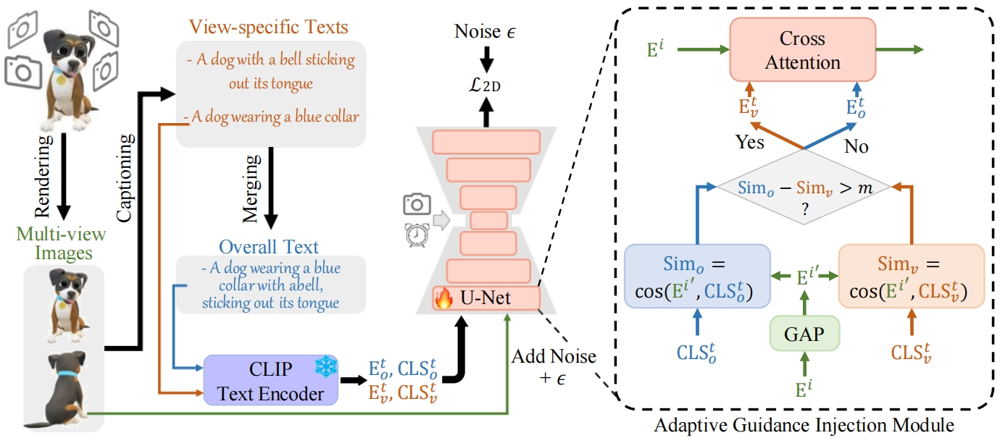
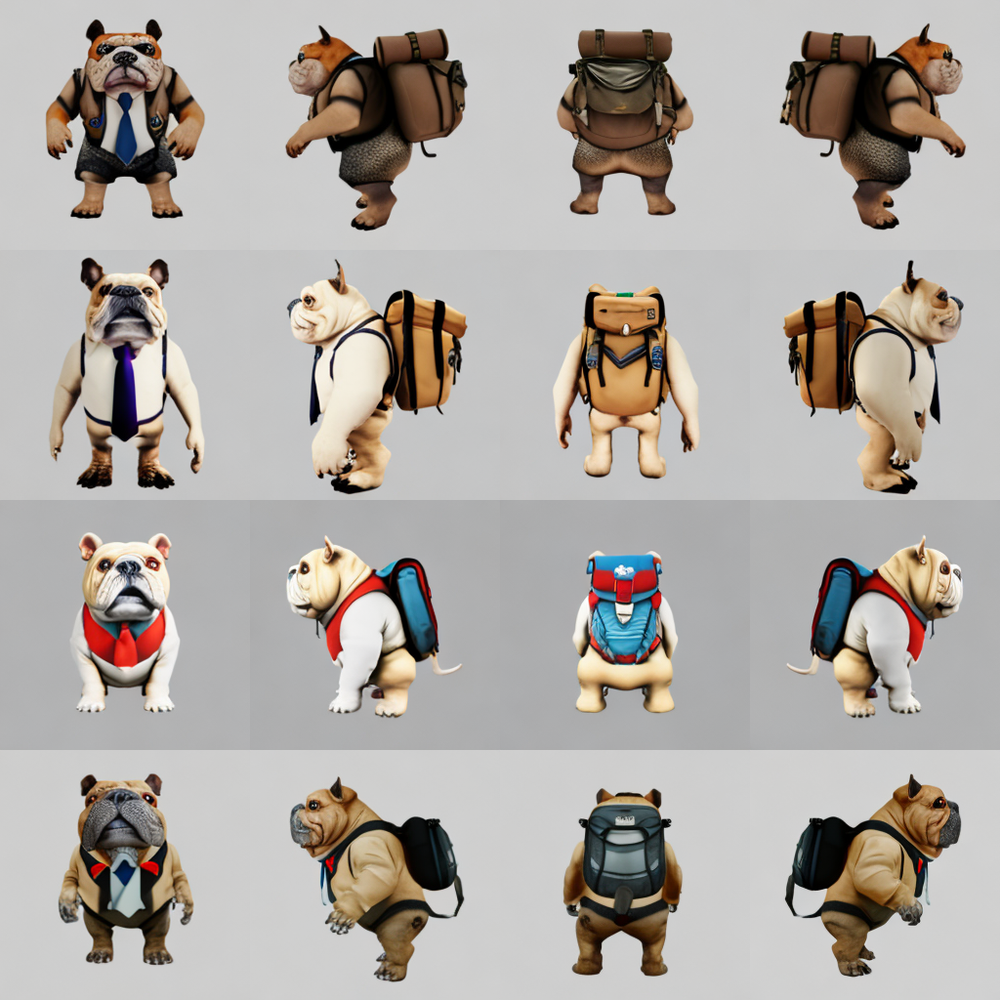

# DreamView
Official PyTorch implementation of paper “DreamView: Injecting View-specific Text Guidance into Text-to-3D Generation”. 



This repository currently only includes the inference code for text-to-image generation (DreamView-2D). The remaining code, such as the training script and 3D generation, will be released in two months.

You can check `DreamView-2D/` for the text-to-image generation code.

## News
- 2024/4/11: We release the inference code of DreamView-2D, and the DreamView checkpoint: [Baidu Drive](https://pan.baidu.com/s/19k9qK7bNNWlChWfe483s9w?pwd=r3ie), [Google Drive](https://drive.google.com/file/d/1MD35zN5niGkV_u77cyLClpVFKjreO1Bf/view?usp=sharing)
- 2024/4/10: Our arxiv paper can be found [here](https://arxiv.org/abs/2404.06119)

## TODO
- [ ] Release the rendered dataset
- [ ] Release the code of DreamView-3D
- [ ] Release the training script for training DreamView-2D

## Preliminary
### Environment
- For DreamView-2D: please follow [MVDream](https://github.com/bytedance/MVDream) to prepare the environments
- For DreamView-3D: TBD...

We also provide our environment for reference, as shown in `DreamView-2D/env-DreamView-2D.txt`

### Checkpoint
- Download the checkpoints at [Baidu Drive](https://pan.baidu.com/s/19k9qK7bNNWlChWfe483s9w?pwd=r3ie), [Google Drive](https://drive.google.com/file/d/1MD35zN5niGkV_u77cyLClpVFKjreO1Bf/view?usp=sharing)
- Move the checkpoints to `ckpts/`

## Text-to-image Generation
### Inference
Running the below script
```
cd DreamView-2D
python t2i.py --num_samples 4 --fp16
```
and you are expected to obtain the below result:

It takes about 10G GPU memory to run the text-to-image generation, and you can modify the `DreamView-2D/t2i.py` to generate your own content.

### Training
TBD...

## Text-to-3D Generation
TBD...

If you have any problem, feel free to open an issue or contact me :-)

## Acknowledgement
- The repository of DreamView-2d is heavily based on [MVDream](https://github.com/bytedance/MVDream) and [Stable Diffusion](https://huggingface.co/stabilityai/stable-diffusion-2-1-base). 
- We would like to thank the authors for sharing their exciting works.

## Citation
- If you find this repo helpful, please consider citing us:
``` bibtex
@article{yan2024DreamView,
  author = {Yan, Junkai and Gao, Yipeng and Yang, Qize and Wei, Xihan and Xie, Xuansong and Wu, Ancong and Zheng, Wei-Shi},
  title = {DreamView: Injecting View-specific Text Guidance into Text-to-3D Generation},
  journal = {arXiv},
  year = {2024}
}
```
